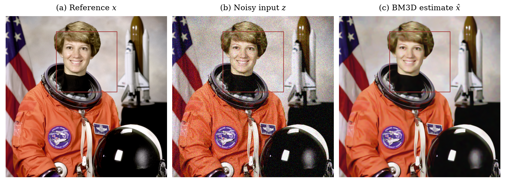
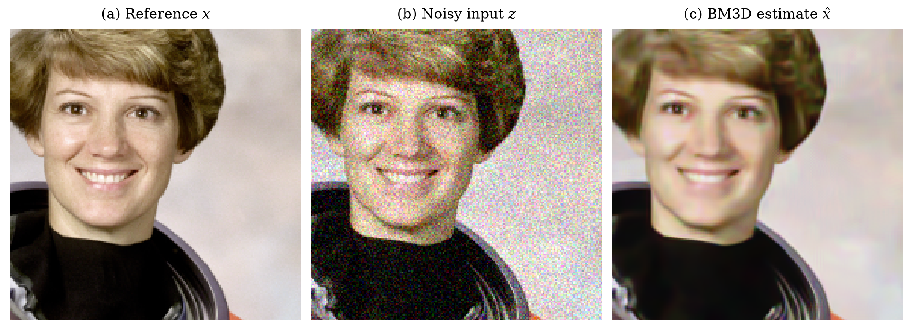
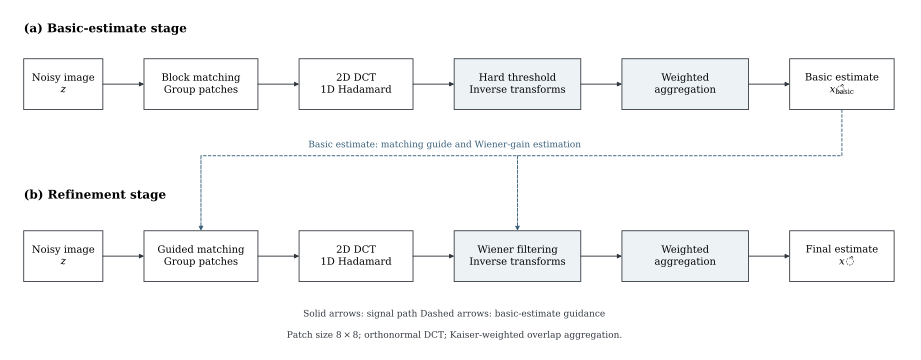

# bm3d-triton

[简体中文](README.zh-CN.md) · [Installation](#get-started) · [API](#python) · [Algorithm](#how-it-works) · [Benchmark](#run-your-own-benchmarks)

BM3D Triton implements block matching and collaborative image filtering as
Triton GPU kernels. It provides a PyTorch tensor API, an inference-only
`nn.Module`, and a command-line image tool.

The implementation combines 8×8 DCT, a Hadamard group transform, and
Kaiser-weighted aggregation. Choose hard-threshold filtering on its own or
add Wiener refinement. Kernels are compiled by Triton on first use; there are
no pretrained weights or project-specific C++/CUDA extensions to build.

| Capability | What you get |
|---|---|
| Tensor API | NCHW input, batch support, arbitrary independently filtered channels |
| Two processing modes | Hard thresholding, or hard thresholding + Wiener refinement |
| Image CLI | 8-bit grayscale, RGB and RGBA; alpha preserved; lossless PNG output |
| Integration | Float32 output on the input CUDA device; no ComfyUI dependency |
| Inspectable implementation | Triton source, independent numerical reference tests, benchmark tools |

## Qualitative illustration



**Figure 1.** (a) Reference image, (b) synthetic Gaussian noise with
`sigma=25/255`, and (c) two-stage BM3D reconstruction. Boxes indicate the common
region shown below. No sharpening or learned postprocessing is applied.

<details>
<summary>Inspect the same detail crop</summary>



**Figure 2.** Identical crops from Figure 1, displayed with nearest-neighbor
sampling. All figures are generated by Python/Matplotlib; PNG, vector PDF and
diagram SVG exports are available in [assets/](assets/README.md), with source
attribution and the reproduction command. No benchmark scores are included.

</details>

## Get started

Use Python 3.10+ with an NVIDIA GPU and a compatible CUDA-enabled PyTorch build.
Install PyTorch using its [installation selector](https://pytorch.org/get-started/locally/),
then run this from the checkout:

```bash
python -m pip install -e ".[cuda,cli]"
```

If PyTorch already supplies a compatible Triton version, `.[cli]` is sufficient.
Linux is the primary execution environment; Windows with `triton-windows` is
experimental. Keep Triton compatible with the installed PyTorch version.
Check `torch.cuda.is_available()` before use; the first call includes JIT compilation.

### Python

```python
import torch
from bm3d_triton import denoise

# Replace with your own floating-point NCHW image, normalized to [0, 1].
image = torch.rand(1, 3, 256, 256, device="cuda")
restored = denoise(image, sigma=25 / 255, two_step=True)
```

Python `sigma` is a **standard deviation in normalized units**. An 8-bit sigma
of 25 means `25/255`, not `25`. For an existing variance or a module interface:

```python
from bm3d_triton import BM3D, denoise_variance

restored = denoise_variance(image, variance=(25 / 255) ** 2)
restored = BM3D(sigma=25 / 255)(image)
```

The output has the input shape and device, with contiguous float32 storage.
Input and default output are clipped to `[0,1]`; `clamp=False` keeps reconstruction
overshoot. Images smaller than 8×8 are replicate-padded and cropped back.

Inputs must have nonempty NCHW dimensions and floating-point dtype. `sigma`
and `variance` are finite nonnegative Python scalars. Zero noise returns a
clipped float32 copy. The tensor API filters every channel, including alpha;
only the CLI preserves alpha separately. `BM3D` has no parameters and its
settings are ordinary attributes, not serialized by `state_dict()`.

### Command line

```bash
bm3d-triton noisy.png restored.png --sigma 25
bm3d-triton noisy.png single-stage.png --sigma 25 --single-stage
bm3d-triton noisy.png restored.png --sigma 15 --device cuda:0 --overwrite
```

The CLI uses **8-bit sigma units**. It accepts 8-bit L/RGB/RGBA input, applies
EXIF orientation and preserves alpha. Output is PNG; existing files require
`--overwrite`. Metadata and ICC profiles are not copied. High-bit-depth and
color-managed workflows should perform their own explicit conversion.

## How it works



**Figure 3.** Two-stage computation. Solid arrows denote signal flow; dashed
arrows denote basic-estimate guidance for matching and Wiener gain estimation.

Similar patches are gathered into groups so their repeated structure can be
filtered jointly in the transform domain. The first stage constructs a basic
estimate. The second uses that estimate to guide patch matching and Wiener
gains, while filtering patches from the original noisy image. Overlapping
patches are combined with a Kaiser window and group-dependent weights.

This is a **DCT/Hadamard BM3D variant with independently processed channels**.
It is not the official BM3D reference implementation or joint-color CBM3D.

| Parameter | Hard threshold | Wiener refinement |
|---|---:|---:|
| Patch size | 8×8 | 8×8 |
| Reference stride / search radius | 3 / 19 pixels | 3 / 19 pixels |
| Maximum group size, including reference | 16 | 32 |
| Matching threshold, mean squared distance in 8-bit units | 2500 | 400 |
| Kaiser window beta | 2.0 | 2.0 |

Groups are rounded down to a power of two. Each patch undergoes orthonormal
DCT, followed by an unnormalized Hadamard transform along the group dimension.
For group size `m` and noise variance `v`, the hard threshold is `2.7*sqrt(m*v)`.
In the Wiener stage, basic-estimate coefficients `b` determine gains
`(b*b/m)/(b*b/m + v)`. Inverse Hadamard transforms divide by `m`; filtered
patches are accumulated with group weights and a Kaiser window.

Matching uses float32 distances. Reference positions include right/bottom
boundaries. Location/count buffers process at most 4096 groups per chunk;
image-level aggregation memory still grows with resolution. The input and
basic estimate are retained for the second stage.

## Run your own benchmarks

The repository provides benchmark tools and measurement instructions rather
than published timing tables, quality scores or hardware-specific speed claims.

```bash
# Warm GPU timings; sizes are HxW.
python benchmarks/benchmark.py --sizes 256x256 512x512 1080x1920 --warmup 3 --repeats 10

# Evaluate local images and generate comparison crops.
python -m pip install -e ".[eval]"
python benchmarks/evaluate.py /path/to/image.png --sigma 10 25 50 --seeds 123 456 789
```

Timing measures synchronized GPU-resident inference after warmup. Evaluation
adds reproducible Gaussian noise and computes PSNR/SSIM against the source.
Outputs stay in ignored `benchmark-output/` and `quality-output/` directories.
Timing excludes initial JIT, CPU/GPU transfers, image I/O and output clipping;
it includes in-call allocation and dispatch (`clamp=False`). Wall-clock and CUDA
event samples are saved locally. Report cold-start costs separately.

Evaluation center-crops local 8-bit L/RGB images to at most 512×512 without
resizing, adds seeded Gaussian noise and clips inputs/outputs. SSIM uses an
11-pixel Gaussian window, sigma 1.5, population covariance and `data_range=1`,
averaged across color channels. It also saves local comparison crops. No datasets
are downloaded. Review textures and edges alongside metrics.

Both scripts accept `--reference-module` and `--reference-path` for an external
comparator exposing `forward(contiguous_HW_float32, normalized_variance,
two_step) -> HW_float32` on CUDA. No reference extension is bundled. Use
`--help` for options; keep hardware load, input, precision and sigma consistent
when comparing implementations.

## Development

```bash
python -m pip install -e ".[dev,cli]"
ruff check .
ruff format --check .
pytest -m "not cuda"  # API and image-I/O tests
pytest               # includes GPU tests when available
python -m build
python -m twine check dist/*
```

GPU tests compare actual kernels against an independent dense-matrix reference.
CPU CI covers import, API, file I/O and packaging; GPU CI is manually triggered
on a configured NVIDIA runner. Test coverage, contribution conventions and
release steps are consolidated in [CONTRIBUTING.md](CONTRIBUTING.md).

```text
src/bm3d_triton/   Public API, CLI and Triton kernels
assets/           README images, pipeline diagram and attribution
tools/            Matplotlib documentation-figure generator
benchmarks/       Timing and image-quality evaluation tools
tests/            CPU contracts and GPU numerical tests
.github/          CPU and manually triggered GPU workflows
```

## Scope and limitations

The denoiser assumes a single scalar noise level and finite floating-point
images. It does not estimate noise or implement joint-color, temporal, HDR,
spatially varying or learned denoising. High noise levels can smooth fine
textures. CPU, MPS and ROCm execution are not supported.

This is inference-only: gradients are not provided. First calls incur JIT
latency, and batch/channel items are dispatched sequentially. Float32 atomics
and near-tie rematching can cause small run-to-run differences. Exact
determinism, CUDA graph capture and `torch.compile` support are not promised.

## License and credits

BSD-2-Clause. See [LICENSE](LICENSE) and [NOTICE](NOTICE) for the BM3D paper
and bm3d-gpu attribution. Documentation photographs have separate provenance
in [assets/README.md](assets/README.md). Community and reporting policies:
[Contributing](CONTRIBUTING.md) · [Security](SECURITY.md).
